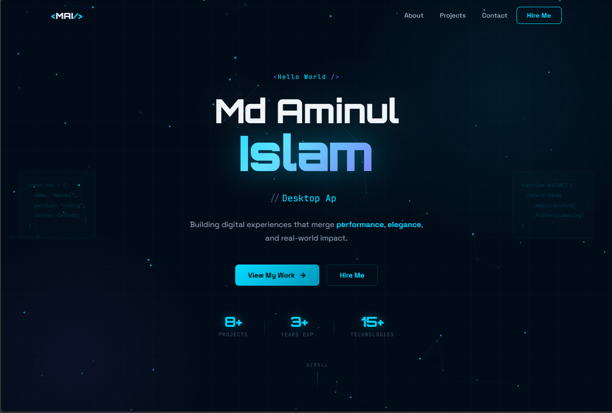

# 🚀 aminul.tech — High-Performance Portfolio

🔗 **Live:** https://aminul.tech
🔗 **GitHub:** https://github.com/anikdife

---

## ⚡ Overview

A **production-grade portfolio platform** engineered to showcase real-world systems, not just UI.

Built with a focus on:

* performance-first architecture
* scalable frontend systems
* real application integration (AI, PDF engine, data pipelines)

---

## 🖼️ Preview



---

## 🧠 Why This Portfolio Is Different

Most portfolios are static.

This one is **engineered**.

* Uses Web Workers for heavy processing (PDF engine)
* Optimized for edge delivery (Cloudflare)
* Built with modular architecture
* Integrated with real production apps
* Reflects systems thinking, not just UI skills

---

## ⚙️ Tech Stack

**Frontend**

* React
* TypeScript
* Vite
* TailwindCSS

**State Management**

* Zustand

**3D / UI**

* Three.js
* react-three-fiber

**Processing**

* Web Workers
* pdf.js
* pdf-lib

**Backend**

* Firebase (Auth, Firestore, Storage)

**Cloud**

* Cloudflare Pages

**Tooling**

* GitHub
* VS Code
* Copilot

---

## 🏗️ Architecture

Client (React + Vite)
↓
State Layer (Zustand)
↓
Processing Layer (Web Workers)
↓
External Services
├── Firebase (Auth / Firestore / Storage)
├── Supabase (data + assets)
└── AI / External APIs
↓
Edge Deployment (Cloudflare Pages)

---

## ⚡ Engineering Highlights

* Web Worker Offloading
  Heavy PDF operations run outside the main thread → no UI blocking

* Edge-Optimized Deployment
  Hosted on Cloudflare → low latency globally

* State Architecture (Zustand)
  Lightweight, scalable state control

* Advanced Document Pipeline

  * merge / split / extract / rotate
  * thumbnail caching
  * page-level operations

* Component-Driven Design
  Clean separation → scalable UI system

---

## 🧪 Featured Projects

### 🔹 PDFStudio.tech

Advanced browser-based PDF engine

👉 https://pdfstudio.tech

* Client-side PDF rendering (pdf.js)
* Page manipulation engine
* Web Worker processing layer
* Firebase-integrated system

---

### 🔹 Arousha.art

AI-powered NAPLAN preparation system

👉 https://arousha.art

* Writing submission → AI evaluation pipeline
* Structured scoring (strength / weakness / improvement)
* Firestore-based session tracking
* Real-time feedback UX

---

### 🔹 AyahVerse (Android)

Quran learning + analysis platform

* Multi-reciter audio
* Tafsir integration
* Word-level linguistic analysis
* Planned ML-based Tajweed correction

---

## 🚀 Getting Started

```bash
git clone https://github.com/anikdife/aminul-tech.git
cd aminul-tech
npm install
npm run dev
```

---

## 📦 Build

```bash
npm run build
```

---

## 🌍 Deployment

Platform: Cloudflare Pages
Build Command: npm run build
Output Directory: dist

---

## 📈 Performance Strategy

* Code splitting (Vite)
* Lazy loading components
* Web Worker offloading
* Edge CDN delivery
* Optimized asset pipeline

---

## 🔐 Security Considerations

* Environment variables via `VITE_*`
* Firebase access control rules
* No sensitive logic exposed client-side
* API isolation for AI processing

---

## 📬 Contact

📧 [anik.dife@gmail.com](mailto:anik.dife@gmail.com)
🌐 https://aminul.tech
